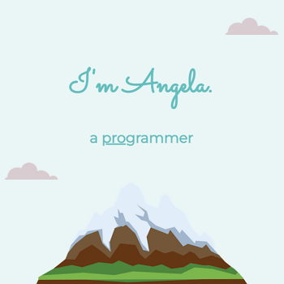

# London App Brewery - Angela's Site

This is a solution to the [Angela's Site](https://www.udemy.com/course/the-complete-web-development-bootcamp/learn/lecture/12287606) challenge on [Udemy](https://www.udemy.com/course/the-complete-web-development-bootcamp/).

## Table of contents

- [Overview](#overview)
  - [The challenge](#the-challenge)
  - [Screenshot](#screenshot)
  - [Links](#links)
- [My process](#my-process)
  - [Built with](#built-with)
  - [How to install and run](#how-to-install-and-run)
- [Author](#author)

## Overview

### The challenge

"Learn the basics of HTML & CSS by making a portfolio site for Angela Yu."

### Screenshot



### Links

- Code URL: [Github](https://github.com/cekstedt/LAB-Angela-Site)
- Live Site URL: [Netlify](https://venerable-llama-f23c38.netlify.app/)
- Challenge URL: [Udemy](https://www.udemy.com/course/the-complete-web-development-bootcamp/learn/lecture/12287606)

## My process

### Built with

- Semantic HTML
- CSS

### How to install and run

This project is HTML & CSS only, so simply clone the repo then open `src/index.html` in your browser.

```
git clone https://github.com/cekstedt/FreeCodeCamp-Photo-Gallery.git
```

## Author

- [@cekstedt](https://github.com/cekstedt)
